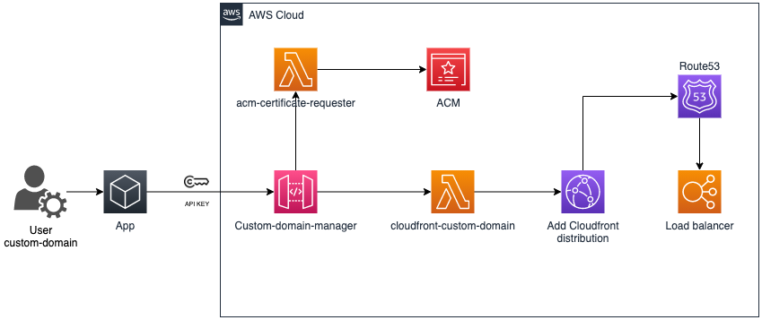

# Custom Domain Manager 🔐

This solution adds custom domain capabilities where a custom domain with SSL certificates using Cloudfront can be used to serve the application content.



### Step 1.

Deploy AWS resources, refer to [Serveless Deployment](#serverless-deployment).
Get your new API Gateway endpoint and API keys, the API keys values are masked during deployment for security reasons; therefore it has to be obtained using AWS console.

### Step 2.

- Request a new ACM certificate:

Send a POST request to your API endpoint: <API_GATEWAY>.execute-api.us-east-1.amazonaws.com/<ENV>/custom-domain-manager/certificate with the following required parameters:


* **domain**: the custom domain to be incorporate to your current application platform.
* **application**: the application name which the custom domain is been requested.

  Example:

```sh
  curl --request POST \
  --url 'https://9jy8oy2yfh.execute-api.us-east-1.amazonaws.com/dev/custom-domain-manager/certificate/' \
  --header 'Accept: application/json' \
  --header 'x-api-key: 1234567890123456789012345678901234567890' \
  --data '{
    "domain": "custom-domain.com",
    "application": "my_app"
  }'
```

 - **Output**:

 It returns the DNS challenge to validate the domain ownership:
 
 Example:

 ```json
{
"Name": "_85e1ea38ec6f2b8bbf8f1fyy5ed7f62f.custom-domain.com.",
 "Type": "CNAME", 
 "Value": "_5a545e75386f8597f263d7c7fa7d58ca.chvvfdvqrj.acm-validations.aws."
 }
 ```

Create the returned record in your domain management tool to ISSUE the requested certificate.

### Step 3.

  Once the ownership of the domain is validated a new certificate will be issued, the next step is to create a new Cloudfront distribution with the new certificate attached to it.

  Once the certificate is **ISSUED** by ACM, send a POST request to your API endpoint: <API_GATEWAY>.execute-api.us-east-1.amazonaws.com/<ENV>/custom-domain-manager/cloudfront with the following required parameters:
    

* **domain**: the domain used to issue a new ACM certificate.
* **url**: the URL to be used by the application.
* **origin**: the origin for the content, must match the certificate used by the Application Load Balancer, AWS docs: .
_Important:_

> The certificate returned from the origin must cover the domain that you specified for Origin Domain Name for the corresponding origin in your distribution.

* **application**: the application name which the custom domain is been requested.

  Example:

  ```sh
  curl --request POST \
  --url 'https://9jy8oy2yfh.execute-api.us-east-1.amazonaws.com/dev/custom-domain-manager/cloudfront/' \
  --header 'Accept: application/json' \
  --header 'x-api-key: 1234567890123456789012345678901234567890' \
  --data '{
    "domain": "custom-domain.com",
    "url": "app.custom-domain.com",
    "origin": "myapplicationloadbalancer.com",
    "application": "my_app"
  }'
  ```

- **Output**:

 It returns the CloudFront endpoint to be used to create your CNAME record in your DNS management tool.
 
 Example:

 ```
{
    "dvn5qt9svaaxy.cloudfront.net"
}
 ```
---
## Deployment Stages 🚀

1. nonprod (dev): `export AWS_ACCOUNT_ID=557014370333 AWS_ROLE=<YOUR_AWS_ROLE>  AWS_ENV=dev`
2. nonprod (staging): `export AWS_ACCOUNT_ID=557014370333 AWS_ROLE=<YOUR_AWS_ROLE>  AWS_ENV=staging`
3. prod (prod): `export AWS_ACCOUNT_ID=144826052300 AWS_ROLE=<YOUR_AWS_ROLE> AWS_ENV=prod`

## Serverless deployment

To deploy this application to AWS follow this list of steps:

1. Authenticate via IDP and collect your temporary token (valid for 12 hours) using the command:

```
make .env.auth
```

2. Export environment variables containing the AWS Account ID, IAM role and AWS environment where you desire to publish the application. A list of predefined variables is available in the last section of this document (Stages), you can also use the example below as reference:

```
export AWS_ACCOUNT_ID=557014370333 AWS_ROLE=<YOUR_AWS_ROLE> AWS_ENV=dev
```

3. Install Python dependencies in Lambda Layers:

```
make install-layer
```

Currently, there is one layer implemented in this project:
- `python` - contains any kind of python public modules defined in the file `src/layer/requirements.txt`.

4. Run `serverless install-sls-plugins deploy` via Docker container based on the command:

```
make install-sls-plugins deploy
```

Your new version should be transferred to the respective AWS Account / Environment and the relevant CloudFormation stack will update the resources described in the manifest `serverless.yml`.

5. In order to get a shell prompt via Docker container run the following command:

```
make shell-sls
```

6. To execute remotely the lambda example provided with this project, execute:

```
sls invoke --function myFunction --data '{"number": 1}'
```

7. To execute unit testing using pytest, execute:

```
make unit-testing
```
